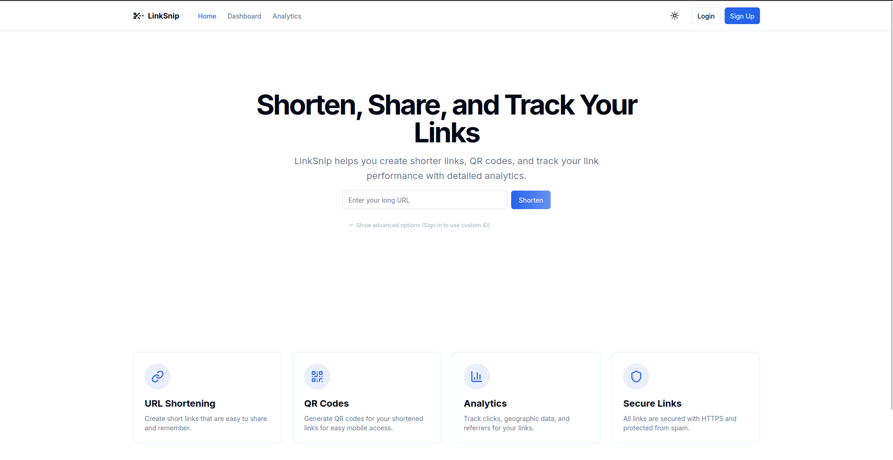

# URL Shortener

✂️ **Shorten. Share. Track.** A sleek, modern URL shortening tool built with simplicity and speed in mind.

---

## 🌟 Overview

Welcome to **URL Shortener**, a lightweight and user-friendly application designed to transform long, unwieldy URLs into short, shareable links. Whether you're sharing on social media, embedding in emails, or just tidying up a link, this tool has you covered. Built with a clean frontend and powered by modern web technologies, it’s fast, responsive, and easy to use.

🔗 **Live Preview**: [Preview](https://url-shortener-client-app.vercel.app/)  
📂 **Source Code**: [GitHub Repository](https://github.com/md-rejoyan-islam/URL-Shortener-frontend)

---

## 🚀 Features

- **Instant URL Shortening**: Paste a long URL and get a short one in seconds.
- **Responsive Design**: Works seamlessly on desktop, tablet, and mobile devices.
- **Copy to Clipboard**: One-click copying for quick sharing.
- **QR Code Generation**: Scan the QR code to access the shortened URL.
- **Link Management**: Keep track of your shortened links in one place.
- **Analytics Dashboard**: Monitor link performance and engagement over time.
- **Secure & Reliable**: Built with robust security measures to protect your data.
- **Lightweight**: Minimalist UI with maximum performance.

---

## 🛠️ Tech Stack

- **Frontend**: Next.js , React.js, TypeScript , Framer Motion
- **Backend**: Node.js, Express.js, MongoDB
- **Styling**: Tailwind CSS, Shadcn UI
- **Deployment**: Vercel
- **API**: [URL Shortener API](https://url-shortener-server-hmoq.onrender.com)
- **Backend Repository**: [GitHub Repository](https://github.com/md-rejoyan-islam/URL-Shortener-backend)

---

## 📬 Contact

---

Got questions, ideas, or just want to say hi? Reach out!

- **Author**: Md Rejoyan Islam
- **GitHub**: [md-rejoyan-islam](https://github.com/md-rejoyan-islam)
- **LinkedIn**: [Md Rejoyan Islam](https://www.linkedin.com/in/md-rejoyan-islam/)
- **Portfolio**: [https://md-rejoyan-islam.github.io](https://md-rejoyan-islam.github.io)
- **Email**: [rejoyanislam0014@gmail.com](mailto:rejoyanislam0014@gmail.com)

---

## 🌟 Show Your Support

If you like this project, give it a ⭐ on GitHub! It means the world to me and keeps the motivation flowing.
